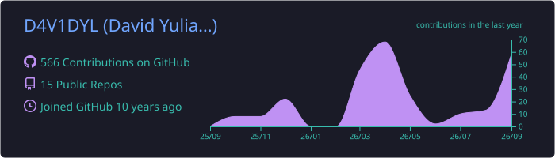
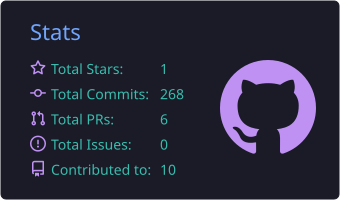
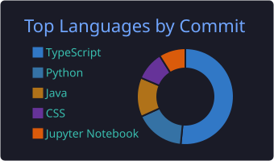
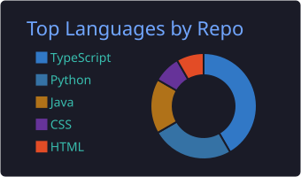
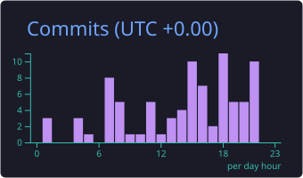

<!-- Header -->
<p align="center">
  
</p>

<p align="center">
  <a href="https://github.com/D4V1DYL">
    
  </a>
</p>

<p align="center">
  
</p>

---

## 👨‍💻 About Me

```ts
const dave = {
  name: "David Yulianto",
  location: "Kudus, Indonesia 🇮🇩",
  education: "Computer Science @ Binus University",
  currently: "Application Developer Intern @ PT Hartono Istana Teknologi (Polytron)",
  focus: ["Enterprise Laravel apps", "Mobile (React Native)", "IoT (ESP32)", "AI / LLM tooling"],
  funFact: "I also run and develop plugins for Minecraft servers ⛏️",
};
```

- 🏢 Building **Artemis**, an internal aftersales management system (Laravel, MySQL multi-DB, queues & schedulers)
- 🌊 Working on IoT projects like a flood detection system with **ESP32 + FastAPI + React Native**
- 🤖 Currently exploring **LLM agents, RAG pipelines**, and privacy-first AI tooling
- 💬 Ask me about **Laravel, React, IoT, or anything backend**

---

## 🛠️ Tech Stack

**Languages**

<p>
  
</p>

**Frontend & Mobile**

<p>
  
  &nbsp;
  
  
</p>

**Backend**

<p>
  
</p>

**Databases**

<p>
  
  &nbsp;
  
</p>

**IoT & Hardware**

<p>
  
  &nbsp;
  
</p>

**DevOps & Tools**

<p>
  
</p>

---

## 🚀 Featured Projects

<!-- TODO: ganti href="#" dengan link repo masing-masing -->

| Project | Description | Stack |
|---|---|---|
| 🌊 **[AquaShield](#)** | IoT flood detection system with real-time alerts to a mobile app | ESP32-C3 · FastAPI · React Native |
| 💸 **[Split Bill](#)** | Split bills with friends in realtime rooms, with AI menu scanning | React Native · Laravel · Claude API |
| 🛡️ **[AI PII Redaction Gateway](#)** | Proxy that redacts sensitive data before prompts reach an LLM | Regex · NER · Local LLM |
| 📦 **[CYD Barcode Scanner](#)** | Barcode scanning demo on an ESP32 display board | ESP32 CYD · GM65 |

---

## 📊 GitHub Stats

<!-- Kartu di bawah dibuat oleh GitHub Action (.github/workflows/profile-cards.yml) -->
<p align="center">
  
</p>

<p align="center">
  
  
</p>

<p align="center">
  
  
</p>

<p align="center">
  
</p>

---

## 🐍 Contribution Snake

<!-- Dibuat oleh GitHub Action (.github/workflows/snake.yml) -->
<p align="center">
  <picture>
    <source media="(prefers-color-scheme: dark)" srcset="https://raw.githubusercontent.com/D4V1DYL/D4V1DYL/output/github-snake-dark.svg" />
    <source media="(prefers-color-scheme: light)" srcset="https://raw.githubusercontent.com/D4V1DYL/D4V1DYL/output/github-snake.svg" />
    
  </picture>
</p>

---

## 🤝 Let's Connect

<!-- TODO: isi link akun kamu -->
<p align="center">
  <a href="https://www.linkedin.com/in/YOUR_LINKEDIN"></a>
  <a href="mailto:YOUR_EMAIL"></a>
  <a href="https://YOUR_PORTFOLIO"></a>
</p>

<p align="center">
  
</p>

<p align="center">
  
</p>
